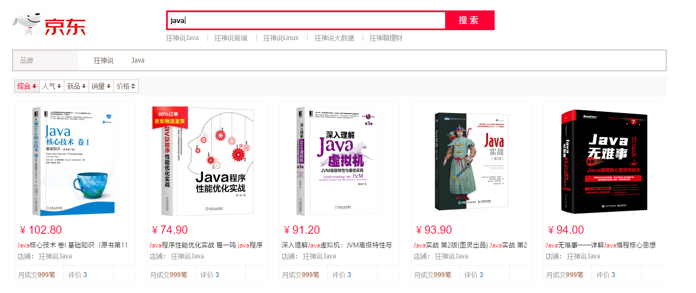

#狂神说ElasticSearch7.6.x课程代码

> [课程链接](https://www.bilibili.com/video/BV17a4y1x7zq)
>
> [课程资料](https://pan.baidu.com/s/1PT3jLvCksOhq7kgAKzQm7g) 提取码：s824
> 
> 作者：遇见狂神说
>
> [笔记参考](https://blog.csdn.net/qq_40649503/article/details/109572150)
>
##1、项目内容
- ElasticSearch7.6.1 基础
- Springboot 整合ES : es-api
- 仿京东搜索项目 : abw-es-api

